# 🎬 Movu - Modern Movie & TV Show Discovery App

<div align="center">
  
  
  
  
  
  
  
  **A beautiful, feature-rich movie and TV show discovery application built with modern Android development practices**
  
  [Download APK](https://drive.google.com/drive/folders/1101Na2csxV_8nbyxAii7F-WFXLwP46KU) | [Features](#-features) | [Architecture](#-architecture) | [Tech Stack](#-tech-stack)

</div>

---

## 📱 About Movu

Movu is a cutting-edge Android application that brings the world of movies and TV shows to your fingertips. Built entirely with **Jetpack Compose** and following **Clean Architecture** principles, Movu offers a seamless and intuitive experience for discovering, reviewing, and managing your favorite entertainment content.

### ✨ What Makes Movu Special?

- 🎨 **Beautiful Material 3 Design** - Modern, fluid UI with smooth animations
- 🔥 **Real-time Reviews** - Firebase-powered review system with instant updates
- 🌙 **Dark/Light Theme** - Automatic theme adaptation for comfortable viewing
- 🔍 **Smart Search** - Quickly find any movie or TV show
- 📚 **Personal Watchlist** - Save content to watch later with local persistence
- 🎭 **Rich Details** - Cast information, ratings, trailers, and more
- 🔐 **Secure Authentication** - Firebase Auth with email/password support
- 📱 **Offline Support** - Room database for seamless offline experience

---

## 🎯 Features

### 🏠 Home Screen
- **Trending Movies & TV Shows** - Discover what's popular right now
- **Random Movie Suggestion** - Get personalized recommendations
- **Category Sections** - Organized content for easy browsing
- **Smooth Navigation** - Intuitive bottom navigation bar

### 🔍 Search
- **Universal Search** - Find movies and TV shows instantly
- **Search History** - Quick access to your recent searches
- **Real-time Results** - Live search as you type
- **Detailed Filters** - Sort and filter results

### 📺 Details Screen
- **Comprehensive Information** - Overview, release date, runtime, genres
- **Cast & Crew** - Complete cast list with photos
- **Video Trailers** - Watch trailers and clips
- **User Reviews** - Read and write reviews with ratings
- **Dynamic Color Palette** - UI adapts to poster colors
- **Watchlist Integration** - One-tap save to watchlist

### ⭐ Review System
- **Rate Content** - 5-star rating system with half-star precision
- **Write Reviews** - Share your thoughts with the community
- **Edit/Delete** - Full control over your reviews
- **User Attribution** - See who wrote each review
- **Real-time Sync** - Firebase Firestore for instant updates
- **Review Count Badge** - See total reviews at a glance

### 📚 Watchlist
- **Save for Later** - Build your personal collection
- **Local Storage** - Fast access with Room database
- **Remove Items** - Easy management of saved content
- **Movies & TV Shows** - Both types in one place

### 👤 Profile
- **User Information** - Display name and email
- **Review History** - See all your reviews
- **Account Management** - Edit profile details
- **Secure Logout** - Safe sign out functionality

### 🔐 Authentication
- **Sign Up** - Create account with username validation
- **Sign In** - Secure login with Firebase
- **Username Uniqueness** - No duplicate usernames allowed
- **Remember Me** - Stay logged in with SharedPreferences
- **Error Handling** - Clear, user-friendly error messages

---

## 🏗️ Architecture

Movu follows **Clean Architecture** principles with a modular, multi-layer design:

```
┌─────────────────────────────────────────────────┐
│                   APP MODULE                     │
│          (Main Application & DI Setup)           │
└─────────────────────────────────────────────────┘
                        │
        ┌───────────────┼───────────────┐
        │               │               │
┌───────▼────────┐ ┌───▼───────┐ ┌────▼─────────┐
│   UI LAYER     │ │  DOMAIN   │ │  DATA LAYER  │
│   (Compose)    │ │  (UseCase)│ │ (Repository) │
└────────────────┘ └───────────┘ └──────────────┘
```

### 📂 Module Structure

The project is organized into **feature-based modules**, each containing three layers:

#### Core Modules
- **`core-ui`** - Shared UI components, themes, and design system
- **`core-data`** - Network layer, API services, and shared data models
- **`core-domain`** - Common domain entities and interfaces
- **`firebase`** - Firebase integration (Auth, Firestore)
- **`navigation`** - Navigation graph and routing

#### Feature Modules
Each feature (Authentication, Home, Details, Search, Watchlist, Profile, Splash) follows this structure:

```
feature/
├── ui/          # Composables, ViewModels, UI logic
├── domain/      # Use cases, business logic
└── data/        # Repositories, data sources
```

### 🔄 Data Flow

```
UI Layer (Compose)
    ↓
ViewModel (State Management)
    ↓
Use Case (Business Logic)
    ↓
Repository (Data Abstraction)
    ↓
Data Source (API/Firebase/Room)
```

---

## 🛠️ Tech Stack

### **Core Technologies**
- **Language:** Kotlin 2.2.20
- **UI Framework:** Jetpack Compose (BOM 2025.09.00)
- **Min SDK:** 24 (Android 7.0)
- **Target SDK:** 36 (Android 14+)
- **Build System:** Gradle with Kotlin DSL

### **Jetpack Libraries**
- **Compose UI** - Modern declarative UI
- **Navigation Compose** - Type-safe navigation
- **Material 3** - Latest Material Design components
- **Lifecycle & ViewModel** - Android architecture components
- **Room** (2.8.0) - Local database with SQLite
- **Splash Screen API** - Native splash screen support
- **Palette KTX** - Dynamic color extraction from images

### **Networking & Serialization**
- **Retrofit** (3.0.0) - Type-safe HTTP client
- **OkHttp** (5.1.0) - Network interceptor and logging
- **Gson** (2.13.2) - JSON serialization
- **Kotlinx Serialization** (1.9.0) - Kotlin-first serialization

### **Firebase Services**
- **Firebase Auth** - User authentication
- **Firebase Firestore** - Cloud database for reviews
- **Firebase BOM** (34.3.0) - Version management

### **Dependency Injection**
- **Koin** (4.1.1) - Lightweight DI framework for Kotlin

### **Image Loading**
- **Coil** (2.7.0) - Modern image loading library for Compose

### **Asynchronous Programming**
- **Kotlin Coroutines** (1.10.2) - Async operations
- **Kotlin Flow** - Reactive data streams

### **Animations**
- **Lottie Compose** (6.6.7) - Beautiful animations

### **Data Source**
- **TMDB API** - The Movie Database for content data

### **Build Logic**
- **Convention Plugins** - Custom Gradle plugins in `build-logic`
- **Version Catalog** - Centralized dependency management

---

## 📐 Design Patterns

### **Clean Architecture**
Separation of concerns across UI, Domain, and Data layers

### **MVI (Model-View-Intent)**
Unidirectional data flow with immutable state management
- **Model** - Represents the UI state
- **View** - Composables that render the state
- **Intent** - User actions and events that trigger state changes

### **Repository Pattern**
Abstraction layer for data sources

### **Use Case Pattern**
Single-responsibility business logic components

### **Dependency Injection**
Koin for loose coupling and testability

### **State Management**
Kotlin StateFlow and Contracts for reactive UI updates with immutable states

---

## 🎨 UI/UX Highlights

- **Material 3 Design System** - Modern, accessible UI components
- **Dynamic Theming** - Colors adapt to content
- **Smooth Animations** - Lottie animations for splash and loading states
- **Edge-to-Edge Display** - Immersive full-screen experience
- **Responsive Layouts** - Adapts to different screen sizes
- **Loading States** - Skeleton screens and progress indicators
- **Error Handling** - User-friendly error messages
- **Empty States** - Helpful messages when no content is available

---

## 🔥 Firebase Integration

### **Authentication**
- Email/password authentication
- User session management
- Secure token handling

### **Firestore Database Structure**

```
📦 Firestore Collections
├── 🎬 movie_reviews/
│   └── {movieId}/
│       └── reviews/
│           └── {userId}/
├── 📺 tv_reviews/
│   └── {tvShowId}/
│       └── reviews/
│           └── {userId}/
└── 👤 user_reviews/
    └── {userId}/
        └── reviews/
            ├── movie_{movieId}/
            └── tv_{tvShowId}/
```

**Dual Storage Strategy:**
- Reviews stored by media (for showing all reviews on details page)
- Reviews stored by user (for showing user's review history)

---

## 🚀 Getting Started

### Prerequisites

- Android Studio Ladybug or later
- JDK 11 or higher
- Android SDK 24+
- TMDB API Key (for movie data)
- Firebase Project (for authentication and reviews)

### Installation

1. **Clone the repository**
   ```bash
   git clone https://github.com/yourusername/movu.git
   cd movu
   ```

2. **Add your TMDB API Key**
   - Create or edit `local.properties`
   - Add your TMDB API key in the Constants file:
     ```kotlin
     // core-data/src/main/java/com/example/core_data/utils/Constants.kt
     const val API_KEY = "your_tmdb_api_key_here"
     ```

3. **Configure Firebase**
   - Download `google-services.json` from your Firebase console
   - Place it in the `app/` directory
   - Enable Email/Password authentication in Firebase Console
   - Create Firestore database

4. **Build the project**
   ```bash
   ./gradlew build
   ```

5. **Run on device or emulator**
   ```bash
   ./gradlew installDebug
   ```

### Get TMDB API Key

1. Create an account at [TMDB](https://www.themoviedb.org/)
2. Go to Settings → API
3. Request an API key (free for non-commercial use)
4. Copy your API key (v3 auth)

### Firebase Setup

1. Create a new project at [Firebase Console](https://console.firebase.google.com/)
2. Add an Android app with package name `com.example.movu`
3. Download and add `google-services.json`
4. Enable **Email/Password** authentication
5. Create a **Cloud Firestore** database in test mode

---

## 📦 Download

**Ready to try Movu?**

[](https://drive.google.com/drive/folders/1101Na2csxV_8nbyxAii7F-WFXLwP46KU)

---

## 📸 Screenshots

### 🌙 Dark Mode

<div align="center">

| Authentication & Home | Search & Details | Watchlist & Profile |
|:---:|:---:|:---:|
| 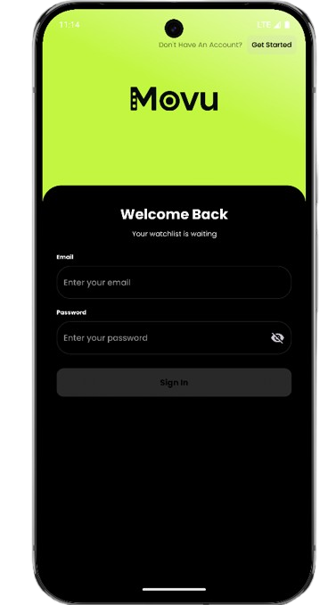 | 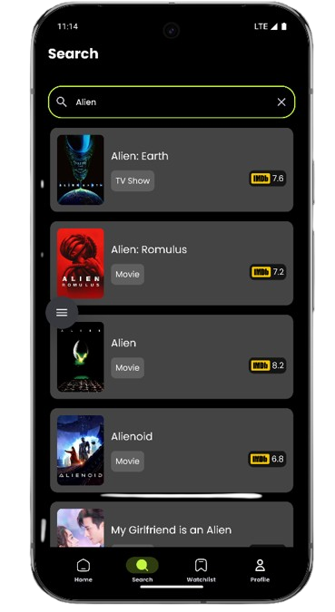 | 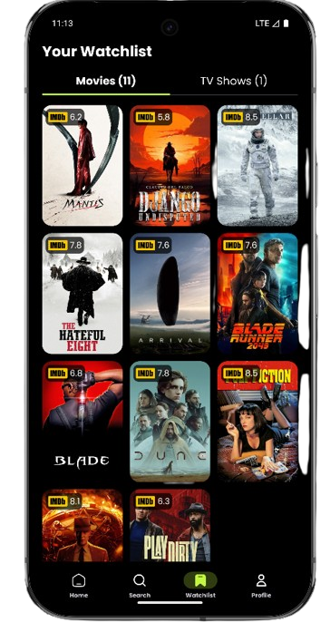 |
| 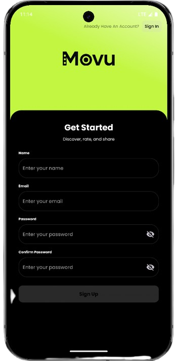 | 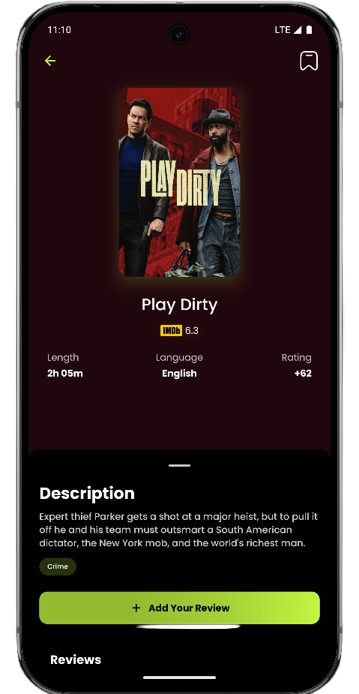 | 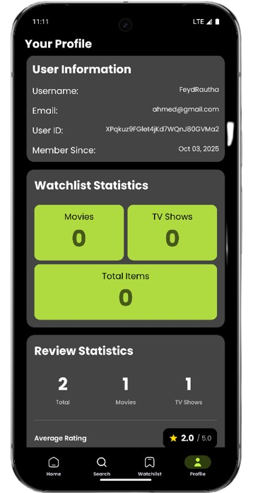 |
| 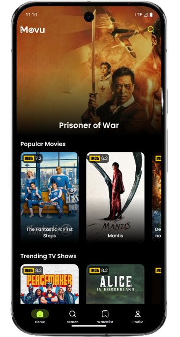 | 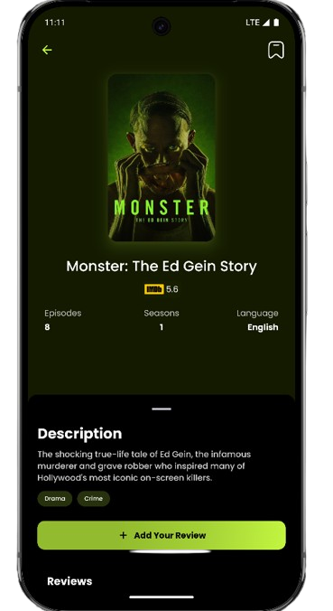 | |

</div>

---

### ☀️ Light Mode

<div align="center">

| Authentication & Home | Search & Details | Watchlist & Profile |
|:---:|:---:|:---:|
| 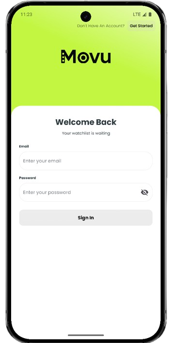 | 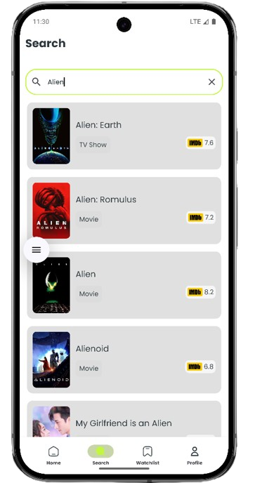 | 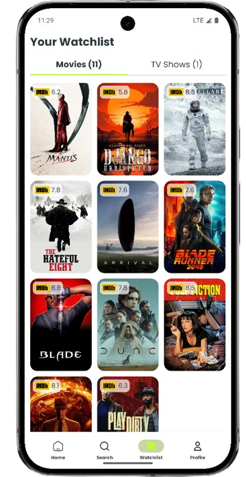 |
| 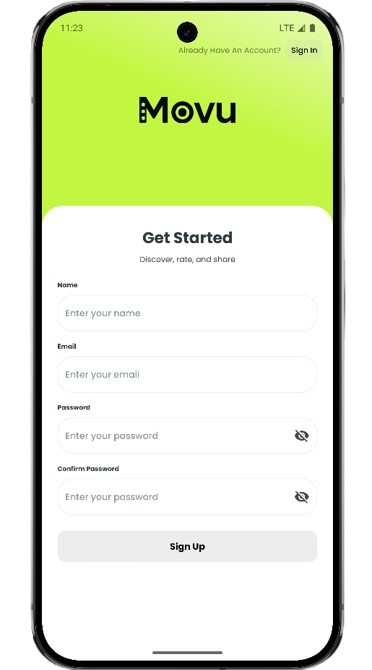 | 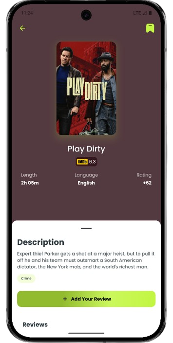 |  |
| 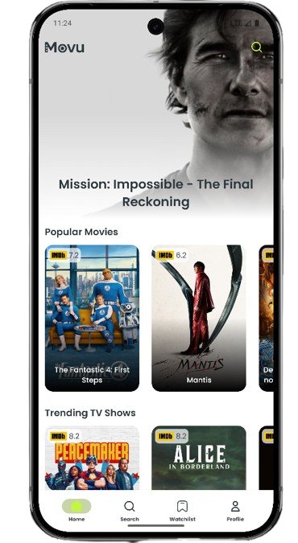 | 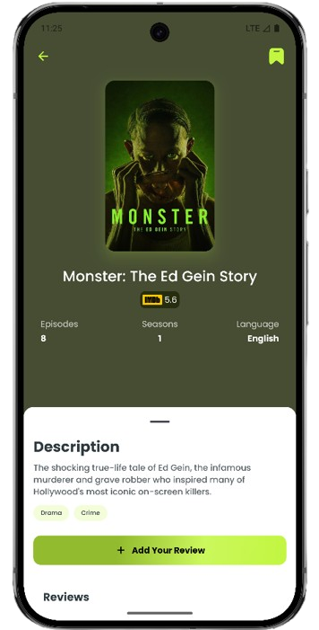 | |

</div>

---

## 🗺️ Roadmap

### Current Version (v1.0)
- ✅ Core movie and TV show browsing
- ✅ User authentication
- ✅ Review system
- ✅ Watchlist functionality
- ✅ Search feature
- ✅ User profiles

### Planned Features
- 🔄 Social features (follow users, like reviews)
- 🔄 Advanced filtering and sorting
- 🔄 Personalized recommendations based on watchlist
- 🔄 Share movies/shows with friends
- 🔄 Notification system for new releases
- 🔄 Multi-language support
- 🔄 Tablet optimization
- 🔄 Offline mode improvements

---

## 🤝 Contributing

Contributions are welcome! Here's how you can help:

1. Fork the repository
2. Create a feature branch (`git checkout -b feature/AmazingFeature`)
3. Commit your changes (`git commit -m 'Add some AmazingFeature'`)
4. Push to the branch (`git push origin feature/AmazingFeature`)
5. Open a Pull Request

### Development Guidelines

- Follow Clean Architecture principles
- Write meaningful commit messages
- Add comments for complex logic
- Test your changes thoroughly
- Update documentation as needed

---

## 📄 License

This project is licensed under the MIT License - see the [LICENSE](LICENSE) file for details.

---

## 🙏 Acknowledgments

- **TMDB** - For providing the comprehensive movie and TV show database
- **Firebase** - For authentication and cloud database services
- **Material Design** - For the beautiful design system
- **Android Community** - For amazing libraries and tools

---

## 📞 Contact & Support

- **Developer:** Ahmed Saber
- **Email:** swe.ahmedsaber@gmail.com
- **GitHub:** [@AHmEeD-SaBER](https://github.com/AHmEeD-SaBER)

---

## 🌟 Star History

If you like this project, please consider giving it a ⭐ on GitHub!

---

<div align="center">
  
  **Made with ❤️ and Jetpack Compose**
  
  
  
  
  
</div>
